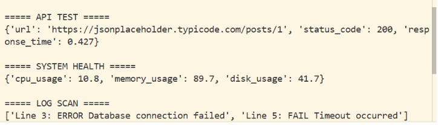

# Intelligent Automation Framework (Python)

## Overview

The Intelligent Automation Framework is a Python-based automation project designed to simulate real-world QA and production-support workflows.

In real production and QA environments, engineers frequently deal with:

- API failures and slow responses
- System resource bottlenecks
- Hidden application errors inside logs
- Repetitive manual diagnostic tasks

This framework was designed to automate these diagnostic and validation activities in a structured, reusable manner.

---

## Key Features

### API Validation Engine
- Sends HTTP requests to target endpoints
- Validates response status codes
- Captures response time metrics

### System Health Monitoring
- Tracks CPU, memory, and disk utilization
- Useful for performance diagnostics

### Log File Analyzer
- Scans logs for ERROR / FAIL / CRITICAL events
- Handles missing log scenarios gracefully

### Modular Design
- Clear separation of responsibilities
- Easily extensible components

---

## Technology Stack

- Python
- Requests (API interactions)
- Psutil (System monitoring)

---

## Example Use Cases

This framework simulates automation tasks such as:

- Monitoring API availability and latency
- Diagnosing system resource anomalies
- Identifying failures from application logs
- Supporting QA / Production troubleshooting workflows

---

## How to Run

Install dependencies:

```bash
pip install -r requirements.txt

## Sample Execution
